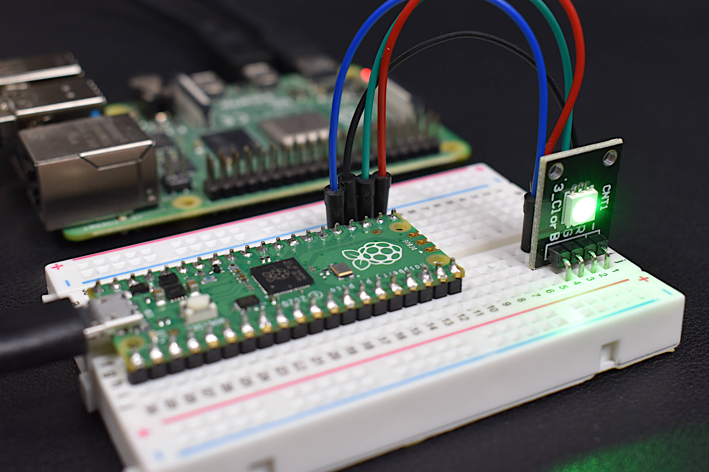

# Raspberry-Pi
Explore my projects developed using Raspberry Pi Pico. Click on each project to view detailed information.

## 📌 Projects

### **LED Control**

- [**Raspberry Pi Pico Morse Code Blinker**](https://github.com/Amid68/Raspberry-Pi-Morse-Code-Blinker)  
  A "Hello World” project for the Raspberry Pi Pico.

## 🔗 Quick Links

- [🏠 Back to Main README](https://github.com/Amid68/Amid68/blob/main/README.md)
- [📁 STM32 Projects](https://github.com/Amid68/STM32/blob/main/README.md)
